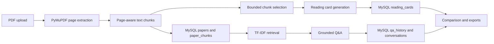

# AI Paper Reader

AI Paper Reader is a local tool for reading and organizing academic papers. It supports PDF upload, structured reading cards, paper-based Q&A, multi-paper comparison, and multiple export formats.

## Features

- Upload and parse multiple PDF papers.
- Store paper metadata, text chunks, reading cards, conversations, and Q&A history in MySQL.
- Detect duplicate uploads through a unique SHA-256 constraint.
- Track source pages, retrieved snippets, model information, and timestamps.
- Generate structured reading cards from paper content.
- Ask single-paper questions using TF-IDF retrieval over saved paper chunks.
- Show answer citations with source pages and retrieved snippets.
- Support follow-up questions while grounding answers in retrieved paper content.
- Compare saved reading cards across multiple papers.
- Delete papers and their related saved content.
- Export reading cards, comparisons, Q&A history, reports, and a JSON or ZIP package of metadata and generated results.

## Screenshots

### Paper Library

Persistent storage of parsed papers, metadata, processing status, and deletion controls.


### Structured Reading Cards

AI-generated reading cards organize the research question, methods, findings, limitations, and practical relevance.


### PDF-Grounded Q&A

Paper-specific conversations use retrieved source chunks and display supporting pages and snippets.


### Multi-Paper Comparison

Saved reading cards can be compared through both an AI-generated comparison summary and a detailed field-by-field view covering paper information, research questions, methods, findings, limitations, environmental relevance, and keywords.

#### Comparison Summary


#### Detailed Comparison


## Tech Stack

- Python
- Streamlit
- LangChain
- `langchain-openai`
- `langchain-core`
- PyMuPDF
- scikit-learn TF-IDF
- SQLAlchemy 2
- MySQL 8
- PyMySQL
- pandas
- Pydantic
- python-dotenv
- fpdf2
- unittest
- Ruff
- GitHub Actions

Requires Python 3.11+.

## Project Structure

```text
main.py
paper_reader/
  models/                     Pydantic and domain schemas
  database/                   SQLAlchemy ORM, sessions, repository, initialization
  pdf_processing/             PDF parsing, SHA-256 IDs, page-aware chunking
  retrieval/                  TF-IDF retrieval
  llm/                        API setup, prompts, and structured parsing
  services/                   Ingestion, reading cards, Q&A, and comparison
  exporting/                  CSV, JSON, Markdown, and PDF export
  ui/                         Streamlit CSS and UI helpers
tests/                        Unit and integration tests
.github/workflows/ci.yml      GitHub Actions workflow with a MySQL service container
```

## Application Flow



## Database Schema

- `papers`: paper metadata and processing status
- `paper_chunks`: page-aware extracted text
- `reading_cards`: structured AI-generated summaries
- `qa_history`: saved questions, answers, and citations
- `conversations`: paper-specific chat sessions
- `conversation_messages`: individual user and assistant messages

## Local Setup

### 1. Clone the repository

```bash
git clone https://github.com/your-username/ai-paper-reader.git
cd ai-paper-reader
```

### 2. Create and activate a virtual environment

```bash
python -m venv .venv
```

Windows PowerShell:

```powershell
.\.venv\Scripts\Activate.ps1
```

Windows Command Prompt:

```cmd
.venv\Scripts\activate
```

macOS or Linux:

```bash
source .venv/bin/activate
```

### 3. Install Python dependencies

```bash
python -m pip install --upgrade pip
python -m pip install -r requirements.txt
```

### 4. Install and start MySQL

Install MySQL 8 using the instructions for your operating system, then start the MySQL service.

### 5. Create a database and project account

Run the following commands as a MySQL administrator. Replace the example username and password with credentials created for your installation.

```sql
CREATE DATABASE paper_reader
CHARACTER SET utf8mb4
COLLATE utf8mb4_unicode_ci;

CREATE USER 'your_app_user'@'localhost'
IDENTIFIED BY 'your_app_password';

GRANT ALL PRIVILEGES ON paper_reader.*
TO 'your_app_user'@'localhost';

FLUSH PRIVILEGES;
```

### 6. Configure the database connection

Copy the example environment file.

Windows PowerShell:

```powershell
Copy-Item .env.example .env
```

Windows Command Prompt:

```cmd
copy .env.example .env
```

macOS or Linux:

```bash
cp .env.example .env
```

Edit `.env` with the database and account created above:

```env
MYSQL_HOST=localhost
MYSQL_PORT=3306
MYSQL_DATABASE=paper_reader
MYSQL_USER=your_app_user
MYSQL_PASSWORD=your_app_password
```

Do not commit the completed `.env` file.

### 7. Run the application

```bash
python -m streamlit run main.py
```

Streamlit normally opens the application at:

```text
http://localhost:8501
```

On first use, enter your own API Key, Base URL, and Model Name in the Streamlit sidebar.

These values are kept only in the current Streamlit session. They are not loaded from `.env` and are not stored in the project database.

## Database Initialization

When the application starts, it connects to the configured MySQL database and automatically creates any missing tables using SQLAlchemy.

Existing tables and records are not deleted or rebuilt. Users need to install MySQL and create the database and database account before running the application.

## Recommended Workflow

```text
Upload Papers
    ↓
Paper Library
    ↓
Reading Cards
    ↓
Paper Q&A
    ↓
Compare Papers
    ↓
Export
```

## How Q&A Works

1. The selected paper's saved chunks are loaded from MySQL.
2. TF-IDF retrieval selects the most relevant chunks.
3. The LLM answers using the retrieved evidence and recent conversation context.
4. Answers, source pages, snippets, and conversation history are saved to MySQL.

## Tests

Run the test suite:

```bash
python -m unittest discover -s tests -v
```

Run lint checks:

```bash
python -m ruff check .
```

Run Python syntax and import compilation checks:

```bash
python -m compileall -q .
```

GitHub Actions runs the same checks with a MySQL 8 service container.

LLM-related tests use parsing checks and service mocks. They do not call paid APIs.

## Privacy and Security

- AI API settings are entered in the Streamlit sidebar and retained only for the current session.
- MySQL settings come from the user's system environment or local `.env` file.
- API keys and database passwords are not stored in application tables, chat history, or exported reports.
- `.env`, uploaded PDFs, generated exports, local databases, caches, and generated user content are excluded from Git.

## Known Limitations

- Scanned PDFs require OCR before they can be processed.
- MySQL must be running for persistent storage.
- TF-IDF retrieval is less semantic than embedding-based retrieval.

## Future Extensions

- Add OCR support for scanned PDFs.
- Add embedding-based retrieval for more semantic search.
