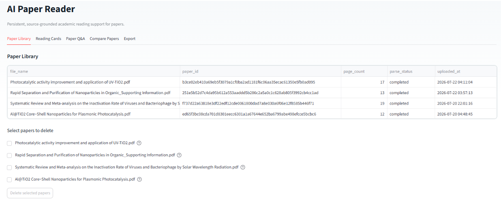
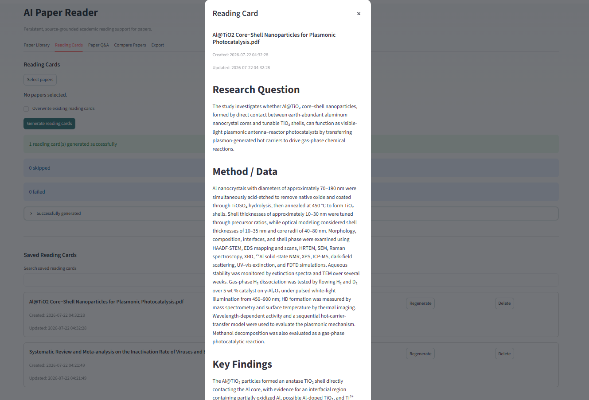
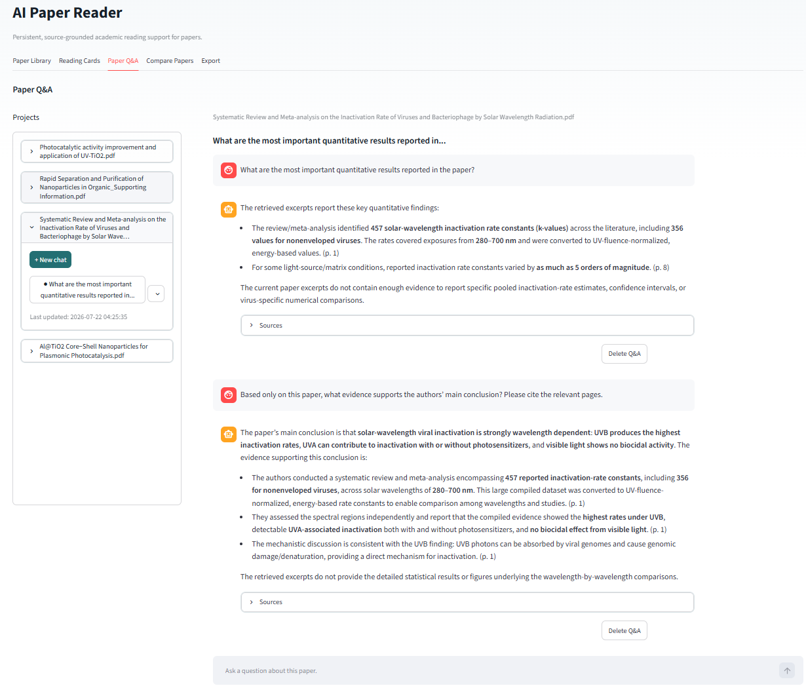
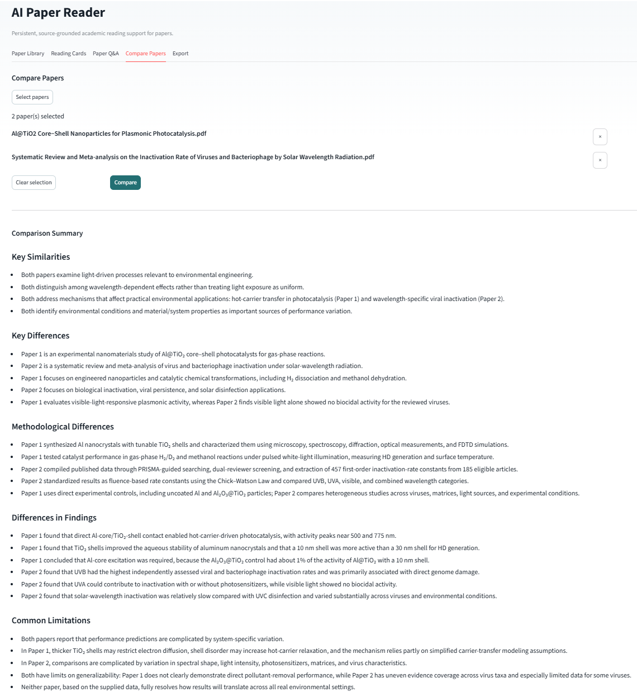
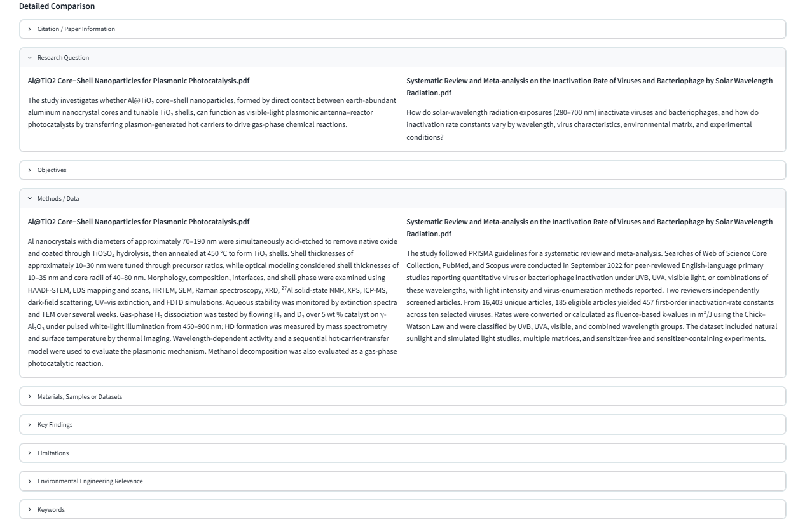
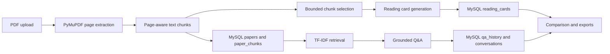

# AI Paper Reader

AI Paper Reader is a Streamlit application for reading, organizing, and comparing academic papers across disciplines.

## Features

- Parse multiple PDFs into page-aware text chunks and store paper data in MySQL.
- Generate structured reading cards covering research aims, approaches, evidence, conclusions, limitations, and significance.
- Answer paper-specific questions using TF-IDF retrieval with page-level citations.
- Maintain separate conversations and Q&A histories for each paper.
- Compare saved papers through summary and field-by-field views.
- Export reading cards, comparisons, reports, and conversation data in multiple formats.
- Isolate data by anonymous workspace and detect duplicate uploads using SHA-256 file hashes.

## Screenshots

### Paper Library

Persistent storage of parsed papers, metadata, processing status, and deletion controls.



### Structured Reading Cards

Reading cards summarize each paper's research objective, approach, evidence, conclusions, limitations, and significance.



### PDF-Grounded Q&A

Paper-specific conversations use retrieved source chunks and display supporting pages and snippets.



### Multi-Paper Comparison

Saved reading cards can be compared through a concise summary or a field-by-field view covering research aims, approaches, evidence, conclusions, limitations, significance, and keywords.

#### Comparison Summary



#### Detailed Comparison



## Tech Stack

- Python
- Streamlit
- LangChain
- `langchain-openai`
- `langchain-core`
- PyMuPDF
- scikit-learn TF-IDF
- SQLAlchemy 2
- MySQL 8
- PyMySQL
- pandas
- Pydantic
- python-dotenv
- fpdf2
- unittest
- Ruff
- GitHub Actions

Requires Python 3.11+.

## Project Structure

```text
main.py
paper_reader/
  models/                     Pydantic and domain schemas
  database/                   SQLAlchemy ORM, sessions, repository, initialization
  pdf_processing/             PDF parsing, SHA-256 hashing, page-aware chunking
  retrieval/                  TF-IDF retrieval
  llm/                        API setup, prompts, and structured parsing
  services/                   Ingestion, reading cards, Q&A, and comparison
  exporting/                  CSV, JSON, Markdown, and PDF export
  ui/                         Streamlit CSS and UI helpers
tests/                        Unit and integration tests
.github/workflows/ci.yml      GitHub Actions workflow with a MySQL service container
```

## Application Flow



## Database Schema

- `papers`: paper metadata and processing status
- `paper_chunks`: page-aware extracted text
- `reading_cards`: structured AI-generated summaries
- `qa_history`: saved questions, answers, and citations
- `conversations`: paper-specific chat sessions
- `conversation_messages`: individual user and assistant messages

## Local Setup

### 1. Clone the repository

```bash
git clone https://github.com/chenhongting80-crypto/LLM-Based-Academic-Paper-Reading-Assistant.git
cd LLM-Based-Academic-Paper-Reading-Assistant
```

### 2. Create and activate a virtual environment

```bash
python -m venv .venv
```

Windows PowerShell:

```powershell
.\.venv\Scripts\Activate.ps1
```

Windows Command Prompt:

```cmd
.venv\Scripts\activate
```

macOS or Linux:

```bash
source .venv/bin/activate
```

### 3. Install Python dependencies

```bash
python -m pip install --upgrade pip
python -m pip install -r requirements.txt
```

### 4. Install and start MySQL

Install MySQL 8 using the instructions for your operating system, then start the MySQL service.

### 5. Create a database and project account

Run the following commands as a MySQL administrator. Replace the example username and password with credentials created for your installation.

```sql
CREATE DATABASE paper_reader
CHARACTER SET utf8mb4
COLLATE utf8mb4_unicode_ci;

CREATE USER 'your_app_user'@'localhost'
IDENTIFIED BY 'your_app_password';

GRANT ALL PRIVILEGES ON paper_reader.*
TO 'your_app_user'@'localhost';

FLUSH PRIVILEGES;
```

### 6. Configure the database connection

Copy the example environment file.

Windows PowerShell:

```powershell
Copy-Item .env.example .env
```

Windows Command Prompt:

```cmd
copy .env.example .env
```

macOS or Linux:

```bash
cp .env.example .env
```

Edit `.env` with the database and account created above:

```env
MYSQL_HOST=localhost
MYSQL_PORT=3306
MYSQL_DATABASE=paper_reader
MYSQL_USER=your_app_user
MYSQL_PASSWORD=your_app_password
```

Do not commit the completed `.env` file.

### 7. Run the application

```bash
python -m streamlit run main.py
```

Provide an API key and an OpenAI-compatible base URL in the sidebar, or set
`OPENAI_API_KEY` and `OPENAI_BASE_URL` as environment variables. The application
retrieves the available models and selects a compatible chat model automatically.

Backend credentials are masked in the interface and are not written to the
project database or included in exports.

## Database Initialization

When the application starts, it connects to the configured MySQL database and automatically creates any missing tables using SQLAlchemy.

Existing tables and records are not deleted or rebuilt. Users need to install MySQL and create the database and database account before running the application.

### Migrating a legacy database

This step is only required for databases created before anonymous workspace
isolation was introduced.

Back up the database, stop the application, and run:

```bash
python -m paper_reader.database.migrate_workspace --apply
```
The migration preserves existing papers, reading cards, conversations, and
related records, and assigns them to a legacy workspace.

After the migration, open the application with:

```text
?workspace=00000000-0000-0000-0000-000000000001
```

## Recommended Workflow

```text
Upload Papers
    ↓
Paper Library
    ↓
Reading Cards
    ↓
Paper Q&A
    ↓
Compare Papers
    ↓
Export
```

## How Q&A Works

1. The selected paper's saved chunks are loaded from MySQL.
2. TF-IDF retrieval selects the most relevant chunks.
3. The LLM answers using the retrieved evidence and recent conversation context.
4. Answers, source pages, snippets, and conversation history are saved to MySQL.

## Tests

Run the test suite:

```bash
python -m unittest discover -s tests -v
```

Run lint checks:

```bash
python -m ruff check .
```

Run Python syntax and import compilation checks:

```bash
python -m compileall -q .
```

GitHub Actions runs the same checks with a MySQL 8 service container.

LLM-related tests use parsing checks and service mocks. They do not call paid APIs.

## Anonymous Workspaces

Each new visit without a `workspace` URL parameter receives a random anonymous workspace UUID. The ID is stored in the current Streamlit session and in the page URL, so refreshing that URL restores the same workspace. Papers, duplicate detection, chunks, reading cards, Q&A, conversations, comparisons, and exports are restricted to that workspace.

A workspace URL is a bearer link, not authentication: anyone who receives the complete URL can access that workspace. Sharing a URL containing the `workspace` parameter is equivalent to sharing all data in that workspace. Do not upload sensitive, confidential, or regulated documents to a public demo.

## Privacy and Security

- API settings entered in the sidebar remain in the current Streamlit session; environment-based credentials remain on the server and are masked in the interface.
- MySQL settings come from the user's system environment or local `.env` file.
- API keys and database passwords are not stored in application tables, chat history, or exported reports.
- `.env`, uploaded PDFs, generated exports, local databases, caches, and generated user content are excluded from Git.

## Known Limitations

- Image-only and scanned PDFs require OCR before upload.
- Persistent storage requires a running MySQL instance.
- TF-IDF relies on lexical overlap and may miss passages that use different terminology for related concepts.

